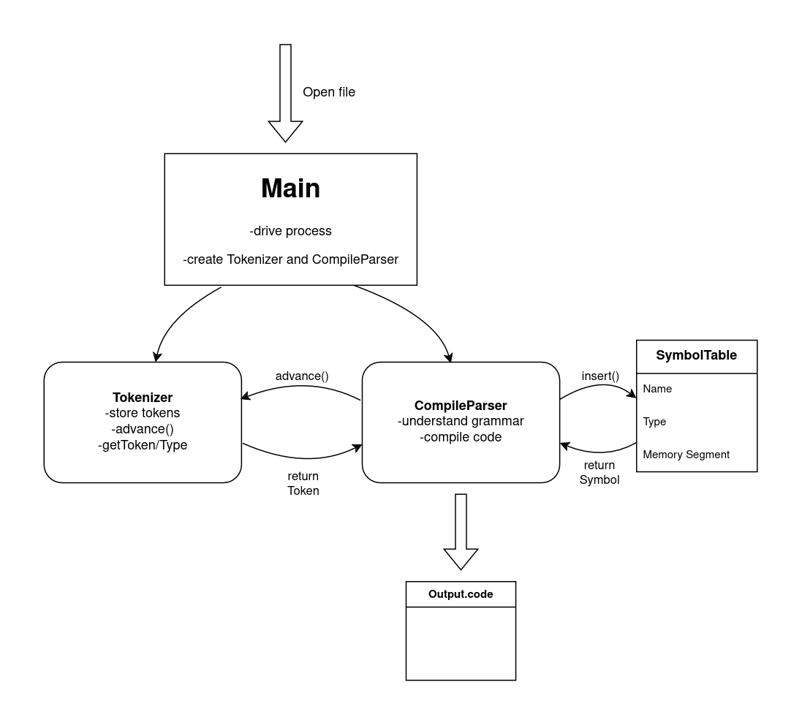

## Jack Compiler
This compiles high-level Jack code to virtual machine byte instructions. Those are to be further compiled into machine assembly language. 
The code will first tokenize the provided code. Then a CompileParser reads the tokens, interprets their meaning and outputs the compiled code to a file.

